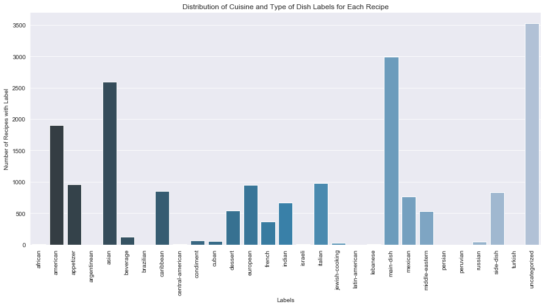
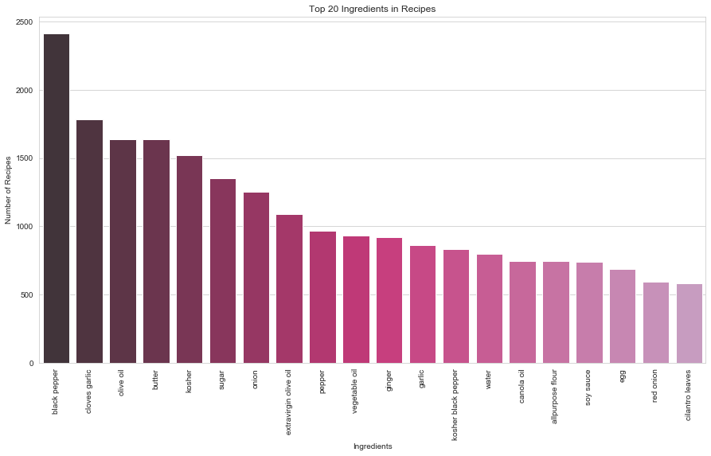

# Are You Hungry? - A Recipe Recommender System

    

## Table of Contents

1. [Project Overview](#project-overview)
2. [Data Collection](#data-collection)
3. [SQL Database](#database)
4. [Exploratory Data Analysis](#exploratory-data-analysis)
5. [Topic Modeling](#topic-modeling)
6. [Generating Recommendations](#generating-recommendations)
7. [Next Steps](#next-steps)
8. [Resources](#resources)

## Project Overview

Throughout human history, food has continuously played a core role in many important events such as the Boston Tea Party in 1773 and the Great Famine or Irish Potato Famine between 1845 and 1849. Besides playing a role in large historical events, it is also an essential part of everyday life, especially for foodies or cooks such as myself, leading to frequent questions such as: what should I eat today, what ingredients do I have at home, what can I make from those ingredients?

In the current technological age, it is very easy to go on the internet and search for recipes of any food I would like to make. However, although it is great that I can access this information at any point, it is overwhelming and impossible to read through the infinitesmal amount of information available to find the recipes I want to make. So how can I access the recipes I am interested in and also access the "hidden" recipes that I may also be interested in without too much work? This is where recommendation systems come in.

The aim of this project is to create a content-based recipe recommender system with a SQL database backend and a front-end user interface which takes in input of ingredients from selected recipes and returns recommendations of recipes which are similar to the selected recipes based on their ingredients.

## Data Collection

Recipes were webscraped using <a src="https://github.com/micahcochran/scrape-schema-recipe">scrape-schema-recipe</a>, a tool for scraping recipes into Python dictionaries, from Food Network (~ 6700 recipes) and Allrecipes (5000+ recipes). Currently, only the Food Network recipes are populated in the database and used in this project. However, recipes from Allrecipes will be added in the next iteration. To ensure there is a wide variety of recipes, Food Network recipes were scraped using international cuisine keywords such as: "american", "asian", "mexican", and "russian", while Allrecipes recipes were scraped from the first 200 pages of the World Cuisines section of the site.

After collection, the recipes were then cleaned, and separated into tables according to the database schema (discussed in the next section) before being loaded into the PostgreSQL database.

## SQL Database Schema

The database schema was sketched on <a src="https://dbdiagram.io/home">dbdiagram.io</a>, an online tool for database schema design created by a Singapore-based BI product company called Holistics. First sketching out the schema and then loading the data helped visualize exactly how the entity-relationship connections should be made to ensure simple extraction for data analysis, modeling, and sync to the recommender system application.

    

## Exploratory Data Analysis (EDA)

Initially the plan for this project was to use the labels of the recipes (ie. Asian, American, Main Dish, Dessert) to differentiate between the recipes for recommendation generation. However, within the data it was discovered that about 1/2 of the recipes were uncategorized. 

    

Since a significant number of recipes were uncategorized, clustering seemed like a great method to use to find labels for these recipes. Since the combination of ingredients is a key component of what makes a recipe unique, based on my knowledge of cooking, it would be interesting to use the ingredients list of each recipe to create a "label" for it. Taking a look at the distribution of ingredients present in the repository of recipes from Food Network, the top 20 ingredients present are:

    

This was useful for determining the ingredients to add to the stopwords list to improve topic assignment during clustering and ultimately the recommendations. 

## Topic Modeling

## Generating Recommendations

## Next Steps

<b><u>Improve Model</u>:</b>
* Additional data cleaning to remove more common ingredients from the model (add them to stopwords)
* Add recipe instructions to the model
* Add more recipes

<b><u>Improve User Interface</u>:</b>
* Improve website UI
* Add input text field - with more data, raw text can be input to generate recommendations

<b><u>Additional Iterations</u>:</b>
* Consider dietary restrictions/preferences and nutrition in the recommendations
    * Add flavor compounds data
    * Add nutrition data of each recipe
* Create a dynamic recommender system in which as user selects a recommended recipe, it is added to the list of selected recipes to trigger a new set of recommendations

## Resources

* <b>Analyzing Recipe Ingredients with LDA:</b> https://medium.com/@sallygao/analyzing-recipe-ingredients-with-latent-dirichlet-allocation-dba49b72d1b9
* <b>Article recommender:</b> https://github.com/kb22/Article-Recommender
* <b>LDA in Python:</b> https://www.machinelearningplus.com/nlp/topic-modeling-python-sklearn-examples/
* <b>Topic Modeling in Python with Gensim:</b> https://www.machinelearningplus.com/nlp/topic-modeling-gensim-python/